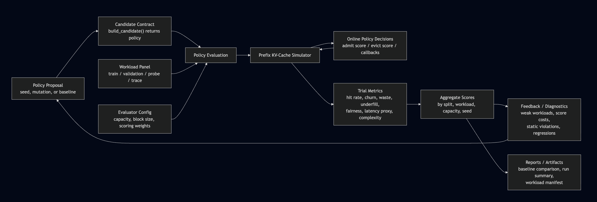

# Prefix Cache Evolve

Can LLM-guided program evolution discover better online prefix KV-cache
admission and eviction heuristics than hand-written baselines?

Prefix KV caches avoid repeated prefill work when requests share prompt
prefixes. That matters for agentic systems, tool use, multi-turn sessions, and
templated serving workloads, but limited capacity makes cache admission and
eviction a consequential online decision. A policy must preserve reusable
prefixes without causing excessive churn, unfairness, or unused capacity.

`prefix-cache-evolve` is a reproducible benchmark and policy-search harness for
studying that decision. It combines a deterministic prefix-tree simulator,
strong deployable and future-knowledge baselines, diverse synthetic workloads,
trace replay, and an LLM-guided code-evolution loop.

## Research Questions

1. Can program evolution produce deployable online policies that beat strong
   hand-written baselines?
2. Which online signals are genuinely useful: recurrence, subtree value,
   admission pressure, tenant or session metadata, or priority?
3. Which workload families and diagnostics expose overfitting or quiet
   regressions?
4. Can evolved policies transfer across cache geometries and from synthetic
   workloads to production trace replay?

The repo tests these questions with fixed multi-seed workload panels, strong
deployable baselines, held-out probes, hidden final-adjudication workloads,
cache-geometry sweeps, trace replay, and controlled ablations.

## Answers So Far

- **Program evolution can find competitive deployable policies.** On the
  historical discovery verifier, the previous promoted policy now scores `77.113`
  under hardened complexity accounting, ahead of
  [TinyLFU-LRU](https://arxiv.org/pdf/1512.00727) at `70.362`, the [vLLM APC-style](https://docs.vllm.ai/en/latest/features/automatic_prefix_caching/) approximation at `60.178`, and LRU
  at `51.186`. It was originally reported as `77.230` before module constants
  were included in the complexity charge.
- **Admission pressure and online structural context have been more useful than
  broad recurrence machinery.** Decayed pressure sharply reduced churn; broad
  explicit recurrence terms hurt, while a narrow recurrence-backed exception
  helped deep agentic reuse.
- **Specialized workloads catch failures that an aggregate score hides.**
  Agentic branching, stochastic serving mixes, and eviction-regret diagnostics
  exposed policies that looked promising before admission regressions or
  workload-specific weaknesses were examined.
- **Geometry transfer improved; trace transfer remains unresolved.** The current
  production-oriented 16-token incumbent now beats TinyLFU-LRU, but no public
  production trace is yet part of the headline comparison.

> This is not a drop-in replacement for vLLM, SGLang, TensorRT-LLM, or another
> serving stack's cache management. It is a research benchmark and policy-search
> harness for studying online prefix-cache heuristics under controlled workloads.

## Headline Result

The current production-oriented 16-token policy scores `65.649`, ahead of
TinyLFU-LRU at `63.548`, while passing both held-out per-family tripwires and
retaining substantially lower churn. The historical 8-token discovery policy
scores `77.113` under the hardened counter, but the production policy does not
transfer unchanged to that
finer geometry.

The main result is methodological: selective pressure-aware admission,
fine-grained evaluator feedback, specialist archive dimensions, and explicit
simplification produced useful compact policies, while richer structured and
eviction-specialist policies failed complexity or cross-panel promotion gates.
The search treats semantic validity and final deployability as hard constraints,
cache economics and service quality as soft objectives, and complexity as staged:
bounded over-cap proposals may be explored, but must be simplified below the hard
promotion cap.

See the current [technical report](docs/technical_report.tex), supplementary
[research log](docs/research_log.tex), generated [result summaries](docs/results/),
and [reproducibility guide](docs/reproducibility.md).

## System Overview



* **Policy Proposal**: A seed, mutation, incumbent, or baseline cache policy being tested.

* **Candidate Contract**: The required interface: a factory that returns a policy with admission, eviction, and lifecycle callback methods.

* **Policy Evaluation**: Loads the policy, checks it, runs it against workloads, and produces evaluation results.

* **Workload Panel**: Deterministic traffic scenarios used to test cache behavior across different serving patterns.

* **Evaluator Config**: YAML settings for capacity, block size, seeds, workloads, limits, and scoring weights.

* **Prefix KV-Cache Simulator**: Simulates cache state, prefix hits, admissions, evictions, active pins, and capacity pressure.

* **Online Policy Decisions**: The policy’s per-request choices: admit missed blocks, evict resident blocks, and update internal state from callbacks.

* **Trial Metrics**: Raw behavior measurements such as hit rate, churn, underfill, admission waste, fairness, latency proxy, and avoidable evictions.

* **Aggregate Scores**: Combines trial metrics across workloads, seeds, and capacities into overall policy scores.

* **Feedback / Diagnostics**: Explains weaknesses, regressions, static violations, and score costs to guide the next proposal.

* **Reports / Artifacts**: Saved outputs such as baseline comparisons, metrics JSON, run summaries, manifests, and candidate programs.

## Where Collaboration Helps

Use the repo to benchmark a policy against controlled workloads, inspect its
request-by-request behavior in the interactive lab, or evolve new policies. The
highest-value contributions are workload models and anonymized trace replays
that expose real serving failure modes, comparisons against production cache
managers, and policy ideas that improve agentic trace branching or transfer
across cache geometries.

## What Is Included

- A deterministic prefix-cache simulator with root-contiguous hits, leaf-only
  eviction, active decode pins, forced bypass, partial blocks, and an opt-in
  shared prefix/decode KV-capacity stress mode.
- Online candidate metadata for recurrence, subtree value, admission pressure,
  miss rate, priority, tenant, and session behavior.
- Deployable baselines including vLLM APC, SGLang RadixAttention, LRU, LFU,
  TinyLFU-LRU, recompute-aware, prefix-fanout, and tenant-fair policies.
- Reporting-only future-knowledge baselines, including a constrained next-use
  oracle.
- Fine-grained verifier metrics for token and block hits, request tails,
  admission utility and waste, avoidable evictions, policy-caused underfill,
  churn, fairness, and complexity.
- Synthetic train, validation, quarantined recurrence probe, and hidden workload
  panels, including irregular agentic tool workflows with forks and replans.
- An anonymized metadata-only trace calibration and replay path.
- Compact and structured policy seeds, a deterministic coefficient tuner, and a
  structured ablation harness.
- Optional canonical primitives for bounded decay state and compact threshold
  hinges, with bounded form-aware complexity credits.
- A Levi adapter that persists the winning program and automatically decomposes
  the strongest generated non-seed mutation.

## Reproducibility

**Policy evaluation is deterministic for the same source, Python environment,
evaluator config, and deterministic candidate policy. LLM-guided search has
explicit seed controls, but remote providers and asynchronous workers can still
prevent bit-for-bit replay of the mutation sequence.**

The evaluator constructs each synthetic stream with a locally scoped
`random.Random(actual_seed)`, where `actual_seed` is the configured base seed
plus a deterministic family-position offset. Prefix IDs use stable
cryptographic hashes rather than Python's process-randomized `hash()`.
Capacity sweeps replay the same generated stream at every capacity.
Candidates receive a separate fixed `policy_seed`, opaque request IDs, a
normalized request type, and empty prompt-token metadata. Workload-generation
seeds and descriptive synthetic labels are not candidate-visible.

The separate `search.seed` seeds Python and NumPy selection in the Levi process
and supplies derived request seeds to model providers that support them. Saved
runs record the resolved model identifiers, search seed, package versions, Git
revision and dirty state, config snapshot, and workload manifest. See the
[reproducibility and model-provider guide](docs/reproducibility.md).

The hardened `77.113` headline result uses synthetic traffic only. No private or external
production trace contributes to that score. Its reproducibility inputs are all
committed:

- Workload generator:
  [`prefix_kv_cache.py`](src/prefix_cache_evolve/evaluators/prefix_kv_cache.py)
- Exact historical evaluator settings:
  [`prefix_kv_cache_discovery.yaml`](configs/prefix_kv_cache_discovery.yaml)
- Per-stream summaries and SHA-256 fingerprints:
  [`discovery_workload_manifest.json`](docs/results/discovery_workload_manifest.json)
- Workload descriptions and failure modes:
  [`docs/technical_report.tex`](docs/technical_report.tex)

The committed discovery manifest covers 81 ordered request streams and has
panel fingerprint
`4607782d231560f5d51c5f0347a789b7b82a7e8ff4d78ec5f1adb576c68d2c8f`.
It also records the CPython version and workload-generator source hash; the
repository's committed `uv.lock` pins dependency resolution.
Recreate it and the headline comparison with:

```bash
.venv/bin/prefix-cache-evolve \
  --workload-manifest \
  --config configs/prefix_kv_cache_discovery.yaml \
  --workload-manifest-output /tmp/discovery_workload_manifest.json
diff -u docs/results/discovery_workload_manifest.json /tmp/discovery_workload_manifest.json

.venv/bin/prefix-cache-evolve \
  --baseline-report \
  --candidate-program \
  src/prefix_cache_evolve/problems/prefix_kv_cache/pressure_aware_incumbent.py \
  --config configs/prefix_kv_cache_discovery.yaml
```

Production trace replay is a separate, user-supplied path. No canonical public
production trace or download script is currently included, so trace-replay
results are not part of the headline comparison. Calibration and replay reports
record the input file SHA-256; replay reports also record the exact derived
request-stream SHA-256. A published trace result should include the anonymized
JSONL or a download script, its hash, and the replay parameters.

## Candidate Contract

A candidate module exports either `build_candidate(...)` or
`candidate_factory(...)`:

```python
def build_candidate(
    capacity_blocks: int,
    block_size_tokens: int,
    seed: int | None = None,
):
    ...
```

The returned policy implements:

```python
def on_request_start(request, now): ...
def on_cache_hit(block, request, now): ...
def on_cache_miss(block, request, now): ...
def score_admission(block, now) -> float: ...
def score_eviction(block, now) -> float: ...
```

Only the three documented lifecycle callbacks fire. Admission occurs when
`score_admission(...) > 0`. The simulator evicts the legal inactive resident leaf
with the highest eviction score. Candidate code cannot mutate simulator-owned
cache state or access future reuse.

With static source rejection enabled, candidate modules may import only `math`
and documented names from the policy primitives module. Executable policy code
must use ordinary top-level classes or functions; dynamic execution,
introspection, decorators, dunder access, and executable module-level wrappers
are rejected. Uppercase literal constants, `__all__`, and
`candidate_factory = build_candidate` remain valid module assignments.

## Quick Start

Python 3.11 or newer is required.

```bash
# Install the pinned development and evolution environment.
uv sync --frozen --group dev

uv run pytest -q
uv run ruff check .
uv run ruff format --check .

# Launch the interactive policy comparison lab.
uv run prefix-cache-lab

# Fast smoke report. Do not use --quick for ranking decisions.
uv run prefix-cache-evolve --baseline-report --quick

# Full validation comparison for the production incumbent.
uv run prefix-cache-evolve \
  --baseline-report \
  --candidate-program \
  src/prefix_cache_evolve/problems/prefix_kv_cache/production_incumbent.py
```

For evaluator-only use, `uv sync --frozen --no-default-groups` avoids the
Git-hosted Levi dependency. For evolution without development tools, use `uv
sync --frozen --no-default-groups --extra evolution`. The equivalent shortcuts
are `make setup`, `make setup-evolution`, and `make setup-dev`.

Evolution defaults to the production incumbent as its seed; use
`--seed-program` to override it. Inspect all effective model, worker, evaluator,
and seed settings without contacting a provider:

```bash
uv run prefix-cache-evolve --show-config
uv run prefix-cache-evolve --show-config \
  --model anthropic/<model-id> \
  --search-seed 17

uv run prefix-cache-evolve --iterations 100
```

The main configuration is [`configs/prefix_kv_cache.yaml`](configs/prefix_kv_cache.yaml).
The runner packages a fallback copy so the installed console command can still
load its default configuration outside a source checkout. Workflow sections and
problem-owned evaluator settings are validated by Pydantic before execution, so
unknown keys and invalid ranges fail when the configuration is loaded.

Model identifiers use LiteLLM provider prefixes. OpenAI, Anthropic, Google
Gemini, Ollama, and self-hosted OpenAI-compatible examples, including
secret-safe `--api-key-env` and `--api-base` configuration, are documented in
the [model-provider guide](docs/reproducibility.md#bring-your-own-model).

Eviction-specific exploration exposes only one candidate function:
`score_eviction(block, now, frequency, priority)`. The evaluator composes that
function with frozen admission decisions and lifecycle callbacks from the
pressure-aware incumbent. Search ranks raw behavior before complexity so
simplification alone cannot look like eviction progress. Function-only
candidates may explore up to `1000` effective AST nodes:

```bash
.venv/bin/prefix-cache-evolve \
  --iterations 300 \
  --config configs/prefix_kv_cache_eviction_specialist.yaml \
  --artifact-output artifacts/prefix_kv_cache_eviction_specialist_runs
```

The runner automatically uses a function-only eviction seed for this
configuration. Every saved winner is composed back into the complete incumbent
and receives a fail-closed `promotion_adjudication.json`. Promotion requires the
composed deployable source to remain at most `650` effective nodes, strictly
improve raw selection behavior, and pass selection, eviction-regret, aggregate
probe, both probe-family, hidden, and per-family tripwire checks.

A completed 500-budget function-only run improved the raw specialist objective
from `70.989` to `72.091` and filled all 16 archive cells. Its best function
composes to `1,011` effective nodes, so it remains exploration-only and does not
replace the incumbent.

Decision-level follow-up confirms that the specialist is making substantive
ranking changes: it changes `21.5%` of victims and reduces same-state avoidable
choices by a net `131` over `5,402` evictions. A one-coefficient descendant
reweight captures a smaller `+0.168` raw gain at unchanged complexity, but loses
`0.006` hidden score and therefore also remains unpromoted. See the
[eviction decision and distillation analysis](docs/results/eviction_policy_analysis.md).

```bash
.venv/bin/python -m prefix_cache_evolve.tools.analyze_eviction
```

The admission-vs-eviction regret audit turns the claim that admission matters more
than eviction into a strict workload-capacity-seed falsification test. It compares
incoming and resident blocks using a quarantined future-token-value oracle, decomposes
local regret into avoidable admission, avoidable rejection, and value-weighted
avoidable eviction, and emits every group to JSON. On the full incumbent panel, the
strict universal claim is falsified: admission dominates `81/123` regretful groups,
but still accounts for `85.2%` of aggregate surrogate regret. Normalizing each side by
its own decision count reduces groupwise admission dominance to `61/123`:

```bash
.venv/bin/python -m prefix_cache_evolve.tools.analyze_regret
```

The stronger factorial experiment crosses every distinct built-in admission rule
with LRU, LFU, cost-aware LRU, the incumbent's compact value-aware eviction, and a
reporting-only constrained next-use control. Eviction materially affects realized
hit rate, but complexity is not required: LFU and the compact value-aware rule are
nearly tied across selective admission policies. The best deployable pairing is
structured admission plus LFU at `0.5558` mean token hit. For the pressure-aware
admission policy, value-aware eviction improves mean token hit from LRU's `0.5448`
to `0.5535`; constrained next-use reaches `0.5684`.

```bash
.venv/bin/python -m prefix_cache_evolve.tools.analyze_regret \
  --all-admission-policies
```

The shared reasoning-KV robustness panel replays all existing algorithms with
generated decode KV charged against the same capacity as reusable prefixes. The
incumbent has the strongest deployable raw behavior, narrowly ahead of vLLM APC,
but vLLM leads after the framework's incumbent-only complexity charge. The
incumbent's `77.5%` average decode allocation-failure rate shows that eviction
alone cannot sustain the synthetic reasoning bursts. See the
[reasoning decode-KV robustness report](docs/results/reasoning_kv_robustness.md).

```bash
.venv/bin/python -m prefix_cache_evolve.tools.analyze_reasoning_kv
```

Main full-policy evolution initializes from the pressure-aware incumbent, requests
four algorithmically diverse seeds, and requests three mixed variants per accepted
seed. Failed seed retries can consume additional evaluations, so the exact number of
scored initialization programs is run-dependent. The data-driven archive retains both
performance tradeoffs and structural policy differences before normal mutation begins.

The function-only eviction lane instead uses its incumbent-equivalent eviction seed,
requests six diverse seeds and two variants per accepted seed, and uses a 16-cell
archive. This is intentionally broader than the earlier specialist run, whose invalid
full-policy seeds collapsed the archive to three cells.

Mutation prompts reserve guidance slots for the non-quarantined
`agentic_tool_workflows` surrogate and the selectable `stochastic_serving_mix`
workload. Fine-grained feedback includes avoidable eviction and short-reuse
after eviction for each selected workload. Those two eviction-regret metrics,
agentic hit and underfill, and stochastic-mix hit are also archive dimensions,
allowing specialist mutations to survive as stepping-stone parents without
directly optimizing the held-out `agent_trace_branching` probe or changing the
combined selection scalar.

Static and runtime contract failures carry specific repair instructions into
Levi's failure summaries. Mutation prompts also include a compact preflight
checklist for syntax, entry points, documented fields and callbacks, imports,
and complexity headroom.

Every saved evolution run writes a fail-closed surrogate-to-probe tripwire
suite. The agentic branching channel has a `0.12` token-hit-gap limit; the
cyclic working-set channel has a `0.25` limit. Thresholds are explicit evaluator
configuration, and held-out probe metrics remain excluded from selection.

## Interactive Lab


The Prefix Cache Lab runs selected policies over the same deterministic
synthetic request stream, then provides request-by-request playback in a local
browser UI. It compares final rankings, metric trajectories, admissions,
evictions, latency, and the resident prefix-block state after every request.
The default production-oriented cache uses 16 tokens per block and 24 blocks,
for 384 tokens of capacity. Synthetic token streams retain a fixed generation
granularity, so changing cache block size changes cache chunking without also
changing the traffic.

```bash
.venv/bin/prefix-cache-lab --host 127.0.0.1 --port 8765
```

Open `http://127.0.0.1:8765`. Deployable baselines, the pressure-aware incumbent,
and clearly labeled reporting-only future-knowledge policies are available.
Hidden workloads remain excluded from the UI. The frontend consumes a
source-agnostic request snapshot contract so a live-traffic adapter can be added
without changing the visualization model.

## Baseline Sources

The `sglang_radix_attention` baseline models the default replacement behavior of
SGLang's radix cache: retain prefixes at cache-page boundaries, protect nodes
referenced by running requests, and recursively evict the least-recently-used
unreferenced leaf. The benchmark treats every modeled block-tree node as a
cacheable radix unit, making the mapped policy behaviorally equivalent to the
generic admit-all `lru` baseline. It does not model SGLang's cache-aware
scheduler or attention kernels. It is a block-tree approximation: the benchmark
charges capacity in fixed simulator blocks rather than SGLang's native token/page
accounting. It remains selectable in the interactive lab but is excluded from
default comparisons because it duplicates `lru` under this model.

- Paper: [Efficiently Programming Large Language Models using SGLang](https://arxiv.org/html/2312.07104v1)
- Pinned SGLang implementation:
  [`radix_attention.py`](https://github.com/sgl-project/sglang/blob/52f221cce088abc998fa9d3812416a45ee0e2e25/python/sglang/srt/layers/radix_attention.py),
  [`radix_cache.py`](https://github.com/sgl-project/sglang/blob/52f221cce088abc998fa9d3812416a45ee0e2e25/python/sglang/srt/mem_cache/radix_cache.py),
  [`cache_init_params.py`](https://github.com/sgl-project/sglang/blob/52f221cce088abc998fa9d3812416a45ee0e2e25/python/sglang/srt/mem_cache/cache_init_params.py),
  and [`evict_policy.py`](https://github.com/sgl-project/sglang/blob/52f221cce088abc998fa9d3812416a45ee0e2e25/python/sglang/srt/mem_cache/evict_policy.py).

## Reports And Analysis

```bash
# Production block-size robustness over identical traffic and fixed
# 384/768-token capacity tiers.
.venv/bin/prefix-cache-evolve \
  --block-size-report \
  --candidate-program \
  src/prefix_cache_evolve/problems/prefix_kv_cache/production_incumbent.py \
  --block-size-output docs/results/block_size_robustness.md

# Quarantined recurrence/structure probe.
.venv/bin/prefix-cache-evolve \
  --probe-report \
  --candidate-program \
  src/prefix_cache_evolve/problems/prefix_kv_cache/production_incumbent.py

# Hidden panel for final adjudication only.
.venv/bin/prefix-cache-evolve \
  --hidden-report \
  --candidate-program \
  src/prefix_cache_evolve/problems/prefix_kv_cache/production_incumbent.py

# Score-weight sensitivity.
.venv/bin/prefix-cache-evolve \
  --sensitivity-report \
  --candidate-program \
  src/prefix_cache_evolve/problems/prefix_kv_cache/production_incumbent.py

# Structured policy ablation and compact coefficient tuning.
.venv/bin/prefix-cache-ablate-structured
.venv/bin/prefix-cache-tune-compact --samples 180 --full-top 12
```

Trace replay consumes user-supplied anonymized request metadata while preserving
hidden prompt content. See
[`configs/prefix_kv_trace_schema.json`](configs/prefix_kv_trace_schema.json).

```bash
.venv/bin/prefix-cache-evolve --calibrate-trace trace.jsonl
.venv/bin/prefix-cache-evolve \
  --replay-trace trace.jsonl \
  --candidate-program \
  src/prefix_cache_evolve/problems/prefix_kv_cache/production_incumbent.py
```

## Repository Layout

```text
configs/                       Operative Levi/evaluator config and trace schema
docs/                          Current report, research log, and result summaries
scripts/                       Deterministic tuner and structured ablation tools
src/prefix_cache_evolve/
  evaluator_entry.py           Candidate loading and isolated evaluation helpers
  evaluators/contracts.py      Candidate-visible policy interface
  evaluators/baselines.py      Baseline policies and capability registry
  evaluators/baseline_suite.py Baseline evaluation orchestration
  evaluators/complexity.py     Candidate source-complexity analysis
  evaluators/prefix_kv_cache.py
                                Simulator, workloads, metrics, and verifier
  problems/prefix_kv_cache/    Runner, reporting, evaluator entry point, seeds,
                                and replay
  workflow/                    Small Levi configuration/execution adapter
tests/                         Functional PyTest coverage
```

## Trust Boundary

Candidate-visible fields are online-computable at or before the current request.
Future-use information is quarantined to reporting-only baselines and verifier
audits. Probe families are reported but excluded from normal candidate selection;
hidden families are reserved for final adjudication.
