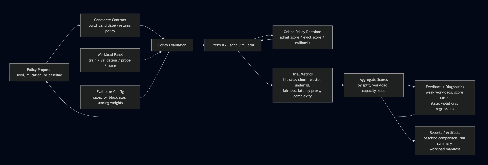

# Prefix Cache Evolve

## Motivation

The KV-cache is a central object of importance in LLM inference. In particular,
prefix KV-caches avoid repeated prefill work when requests share prompt
prefixes. However, any cache policy must be robust on a variety of simulated
traffic such as agentic systems, tool use, multi-turn sessions, and templated
serving workloads. Limited capacity makes cache admission and eviction a
consequential online decision. A policy must preserve reusable prefixes without
causing excessive churn, unfairness, or unused capacity.

Modern KV-caches are typically hand-designed to handle a variety of workflow
loads, such as vLLM's
[Automatic Prefix Caching](https://docs.vllm.ai/en/latest/features/automatic_prefix_caching/).
With the advent of more powerful LLMs and, in particular, coding agents, we ask:

> Can LLM-guided program evolution discover better online prefix KV-cache
> admission and eviction heuristics than hand-written baselines?

We attempt to evolve stronger KV-cache policies. Broadly speaking, we set up a
strong verifier and scoring system and use LLMs as mutation operators via
[Levi](https://ttanv.github.io/levi/docs#why-levi) to evolve candidate policies
on a wide set of workload scenarios. The goal is to evolve a policy better than
any hand-designed KV-cache policy.

Our repo is a reproducible benchmark and policy-search harness for
studying that question. It combines a deterministic prefix-tree simulator,
deployable and future-knowledge baselines, diverse synthetic workloads, trace
replay, and an LLM-guided code-evolution loop.

This is a research benchmark, not a drop-in replacement for the cache manager in
vLLM, SGLang, TensorRT-LLM, or another serving stack.

## Research Questions

1. Can program evolution produce deployable online policies that beat strong
   hand-written baselines?
2. Which online signals are genuinely useful: recurrence, subtree value,
   admission pressure, tenant or session metadata, or priority?
3. Which workload families and diagnostics expose overfitting or quiet
   regressions?
4. Can evolved policies transfer across cache geometries and from synthetic
   workloads to production trace replay?

The repo tests these questions with fixed multi-seed workload panels, strong
deployable baselines, held-out probes, hidden final-adjudication workloads,
cache-geometry sweeps, trace replay, and controlled ablations.

## Headline Result

Evolution found deployable policies with strong but geometry-dependent results.
Scores from different verifier geometries are not directly comparable:

| Policy and evaluation | Candidate | TinyLFU-LRU | Candidate churn per 1k | TinyLFU-LRU churn per 1k |
|---|---:|---:|---:|---:|
| Discovery policy on the historical 8-token verifier | `77.113` | `70.362` | `92.7` | `161.1` |
| Discovery policy transferred to the 16-token verifier | `62.757` | `63.548` | `168.1` | `499.0` |
| Production policy on the operative 16-token verifier | `65.649` | `63.548` | `163.9` | `499.0` |

The original discovery result was reported as `77.230`; hardened complexity
accounting changes it to `77.113` without changing policy behavior. A later
production-oriented search and simplification stage produced the separate
16-token incumbent that clears TinyLFU-LRU.

The broader geometry sweep remains mixed. The production incumbent beats
TinyLFU-LRU at 16- and 24-token blocks, trails it at 32-, 48-, and 64-token
blocks, and has substantially lower churn at every tested block size. A single
policy that dominates across geometries remains an open problem.

### Cost

The following assumes GPT-5.5-mini as the primary model and GPT-5.5 Thinking
with medium reasoning effort as the paradigm-shift model.
The two directly required final-stage searches cost `USD$5.070` in recorded model
API charges: `USD$4.133` for production search and `USD$0.937` for simplification.
The research and development total is at least `USD$44.845` across `2,989` evaluations.
These figures exclude engineering time, local compute, and
experiments without retained cost metadata.

Search cost depends on model, provider, and evaluation budget; the repository
does not yet include a comparable cost study for open-source models.

### Evidence Boundary

All reported comparisons use deterministic synthetic traffic. No public or
external production trace contributes to the headline, so transfer to real
serving traffic remains unanswered.

The `vllm_apc` baseline emulates the core APC cache-policy behavior relevant to
this benchmark: exact-prefix reuse of full KV blocks, protection of blocks used
by active requests, and LRU eviction of reusable unreferenced blocks. It does
not reproduce vLLM's internal data structures or additional serving
optimizations, such as scheduling, allocation, continuous batching, offload,
and kernels. The SGLang entry has the same policy-level scope. These are
controlled cache-policy comparisons, not end-to-end serving throughput results.

## Run It

Python 3.11, 3.12, or 3.13 on Linux or macOS is required. Candidate evaluation
uses POSIX process isolation and is not supported on Windows.

```bash
# Evaluator, simulator, reports, and interactive lab.
make setup

# Launch the policy comparison lab.
uv run prefix-cache-lab

# Run a fast baseline smoke comparison.
uv run prefix-cache-evolve --baseline-report --quick
```

Evaluate the production incumbent on the full validation panel:

```bash
uv run prefix-cache-evolve \
  --baseline-report \
  --candidate-program \
  src/prefix_cache_evolve/problems/prefix_kv_cache/incumbents/production_16tok_20260609/policy.py
```

For development:

```bash
make setup-dev
make check
```

For optional LLM-guided evolution:

```bash
make setup-evolution

# Inspect the resolved configuration without contacting a model provider.
uv run prefix-cache-evolve --show-config

# Start an incumbent-seeded search.
uv run prefix-cache-evolve --iterations 100
```

Evolution uses external model services and may incur cost. Read the
[reproducibility and model-provider guide](docs/reproducibility.md) before a
paid run.

For conversation-derived
[WildChat-1M](https://huggingface.co/datasets/allenai/WildChat-1M) replay:

```bash
# Install the optional dataset and tokenizer dependencies.
make setup-wildchat

# Generate and retain this key for reproducible conversions.
export PREFIX_CACHE_TRACE_HASH_KEY="$(openssl rand -hex 32)"

# Start with a small smoke conversion.
uv run prefix-cache-tools datasets wildchat \
  --conversation-limit 100 \
  --minimum-requests-per-conversation 2

# Inspect the resulting trace before replaying a policy.
uv run prefix-cache-evolve \
  --calibrate-trace artifacts/traces/wildchat.jsonl

# Replay the production incumbent over the converted workload.
uv run prefix-cache-evolve \
  --replay-trace artifacts/traces/wildchat.jsonl \
  --candidate-program \
  src/prefix_cache_evolve/problems/prefix_kv_cache/incumbents/production_16tok_20260609/policy.py
```

The conversion creates `artifacts/traces/wildchat.jsonl` and
`artifacts/traces/wildchat.jsonl.manifest.json`. Increase or remove
`--conversation-limit` for a larger experiment. Retain the same
`PREFIX_CACHE_TRACE_HASH_KEY` value to reproduce identical identifiers and
prefix hashes.

The converter writes only HMAC identifiers, token lengths, timestamps, and
opaque prefix-block hashes. It does not retain prompt text. WildChat's recorded
assistant timestamps mark response completion; replay uses them as timing
proxies. Missing timestamps use synthetic spacing. The result is a
conversation-derived workload rather than a production serving trace.

To use the converted data for evolution, prepare a pinned panel:

```bash
uv run prefix-cache-tools datasets trace-panel \
  --trace artifacts/traces/wildchat.jsonl \
  --family wildchat \
  --output-dir artifacts/traces/wildchat-panel

# Inspect the real-data configuration and compare baselines locally.
uv run prefix-cache-evolve \
  --config artifacts/traces/wildchat-panel/evolution.yaml --show-config
uv run prefix-cache-evolve \
  --config artifacts/traces/wildchat-panel/evolution.yaml --baseline-report

# Optional model-powered search, using the production incumbent as its seed.
uv sync --frozen --extra wildchat --extra evolution
uv run prefix-cache-evolve \
  --config artifacts/traces/wildchat-panel/evolution.yaml --iterations 100
```

The panel keeps each tenant's conversations in one split. Train and validation
are visible during search; hidden traces are reserved for final evaluation.
Synthetic probes are retained, and `--keep-synthetic` also retains the base
train/validation/hidden workloads. Trace checksums and block geometry are
verified before search. See the [trace evolution guide](docs/reproducibility.md#trace-panels-for-evolution)
for sizing, held-out evaluation, and replaying saved runs. The first
[WildChat smoke check](docs/results/wildchat_smoke_20260905.md) exercises this
path with 20 conversations; it is a pipeline check, not a policy-promotion result.

For actual agentic production traffic, the
[Mooncake replay guide](docs/reproducibility.md#agentic-production-replay-mooncake)
uses Kimi's public tool-and-agent serving trace. The new
`prefix-cache-tools datasets mooncake` converter preserves arrival timestamps
and native 512-token prefix hashes. See the
[initial production-trace check](docs/results/mooncake_toolagent_20260905.md).
For evolution, use the [chronological production panel workflow](
docs/reproducibility.md#production-trace-evolution-with-chronological-holdouts).
It preserves unknown session identities, freezes later time windows for final
evaluation, and runs generated candidates in a networkless container.

[Qwen-Bailian and AgentX](docs/serving_datasets.md) add independent production
and coding-agent traces. `datasets qwen` preserves native 16-token block hashes;
`datasets agentx` preserves 64-token session/model-scoped prefixes and nested
request timing. Use Qwen for search and `datasets attach-holdout` to reserve
AgentX for final validation in the `hidden` split. The normal `validation`
split feeds back into evolution and is not held out.
The routine AgentX panel uses four complete sessions selected with a fixed random
seed; its manifest records the selection and a 20-million-input-token budget.

The completed [production agentic evolution](docs/results/mooncake_evolution_20260906.md)
found no improved candidate within its one-hour bound; TinyLFU-LRU remained the
strongest tested policy on untouched later production windows, and no incumbent
was promoted.
The subsequent [GPT-5.6 full run](docs/results/mooncake_evolution_gpt56_20260906.md)
evolved a candidate scoring `61.094` on the production holdout, ahead of
TinyLFU-LRU at `50.491`. It was retained as a production-specialist candidate
rather than promoted because it regressed on the original synthetic suite.

The follow-up [joint synthetic and Mooncake search](docs/results/mooncake_synthetic_evolution_20260907.md)
preserved native 16- and 512-token geometries in one selection suite. Its
audited 613-node candidate scores `62.078` on visible joint validation versus
`61.615` for TinyLFU-LRU, while scoring `65.422` on synthetic validation and
`57.970` on Mooncake validation. After selection was frozen, it scored `6.129`
on the combined hidden panel versus `-0.230` for TinyLFU-LRU. It remains a
candidate because one of seven fail-closed agentic checks, request-tail token
hit, exceeded its gap limit.

Collected agent sessions from
[LMCache Agentic Traces](https://huggingface.co/datasets/sammshen/lmcache-agentic-traces)
can also be converted from pinned Hugging Face or local JSON/Parquet input:

```bash
uv run prefix-cache-tools datasets lmcache-agentic \
  --dataset-revision 6e043b9e89865df3aec19fd5679286b683bfd70e \
  --output artifacts/traces/lmcache-agentic.jsonl
```

The converter verifies cumulative session histories and writes only HMAC
identifiers, lengths, opaque 512-token prefix-block hashes, and deterministic
replay timing. The source is collected agent traffic rather than production
serving telemetry. The completed
[four-domain evolution](docs/results/mooncake_synthetic_wildchat_lmcache_evolution_20260907.md)
added a 16-session LMCache panel to synthetic, Mooncake, and WildChat traffic.
Its policy recovered the seed's agent-session under-admission, but
TinyLFU-LRU won the frozen hidden objective by `19.679` points, so no incumbent
was promoted.

The subsequent [replay audit](docs/results/replay_audit_20260907.md) corrected
missing-session handling, LMCache tenant metadata and invalid-row timing,
WildChat model separation and prompt serialization, and missing train metrics.
The figures above retain their historical replay semantics. Corrected bundles
and a rebuilt container are pinned in
`configs/prefix_kv_cache_replay_audited.yaml`; the audit did not start evolution.

The [full corrected reassessment](docs/results/replay_reassessment_20260908.md)
evaluated 15 policies across 1,815 trials. The newer four-domain policy scores
`54.680`, versus `25.445` for the older joint policy and `61.060` for TinyLFU-LRU.
Before the AST charge, the newer policy leads at `62.844`. Its aggregate
Mooncake regression disappears; synthetic churn remains a weakness.

The [behavior and policy-cost workflow](docs/policy_costs.md) implements the
complexity review's recommendations: raw-score exploration from the newer seed,
retained smaller alternatives, a separate simplification stage with exact
visible-behavior checks, and container-based callback/state profiling. Use
`configs/prefix_kv_cache_replay_exploration.yaml` for the next exploratory run.

Untrusted candidate source must be evaluated in a separate OS sandbox. The
repository includes a locked, non-root Docker profile:

```bash
docker/sandbox/run.sh path/to/candidate.py
```

See [SECURITY.md](SECURITY.md) for the trust boundary and runtime restrictions.

## Interactive Lab


The Prefix Cache Lab replays selected policies over the same deterministic
request stream. It provides request-by-request inspection of policy rankings,
metric trajectories, admissions, evictions, latency, and resident prefix state.

```bash
uv run prefix-cache-lab --host 127.0.0.1 --port 8765
```

Open `http://127.0.0.1:8765`. Hidden workloads remain excluded from the UI.

## System



1. A candidate implements online admission, eviction, and lifecycle callbacks.
2. Static checks and isolated execution enforce the candidate contract.
3. The deterministic simulator evaluates the candidate across workloads, seeds,
   capacities, and cache geometries.
4. The verifier scores hit rate, service tails, churn, underfill, admission
   waste, avoidable eviction, fairness, and source complexity.
5. Fine-grained failures and workload diagnostics guide subsequent mutations.
6. Final promotion requires deployable complexity and fail-closed cross-panel
   adjudication.

Promoted policies are stored as immutable source-and-manifest bundles under
`src/prefix_cache_evolve/problems/prefix_kv_cache/incumbents`. Validate source,
provenance, and benchmark pins with `uv run prefix-cache-tools incumbents validate`.

Candidate-visible fields are online-computable at or before the current request.
Future-use information is quarantined to reporting-only baselines and verifier
audits. Held-out probes and hidden workloads remain outside normal selection.

Detailed documentation:

- [Project overview and documentation](docs/README.md)
- [Technical report](docs/technical_report.tex)
- [Research log](docs/research_log.tex)
- [Reproducibility and model providers](docs/reproducibility.md)
- [Analysis and report tools](src/prefix_cache_evolve/tools/README.md)
